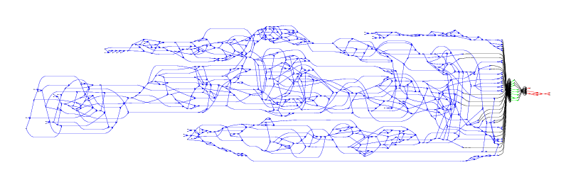

# IgGraph

IgGraph performs VDJ classification of antibody reads using the colored antibody graph (i.e., a colored de Bruijn graph).

[http://sbonisso.github.io/ig_graph/](http://sbonisso.github.io/ig_graph/)

##### Credits

Leap-Day Theme is by [Matt Graham](http://madebygraham.com), twitter [@michigangraham](http://twitter.com/#!/michigangraham). Use, reuse and modify away.

[Creative Commons Attribution](http://creativecommons.org/licenses/by/3.0/)
